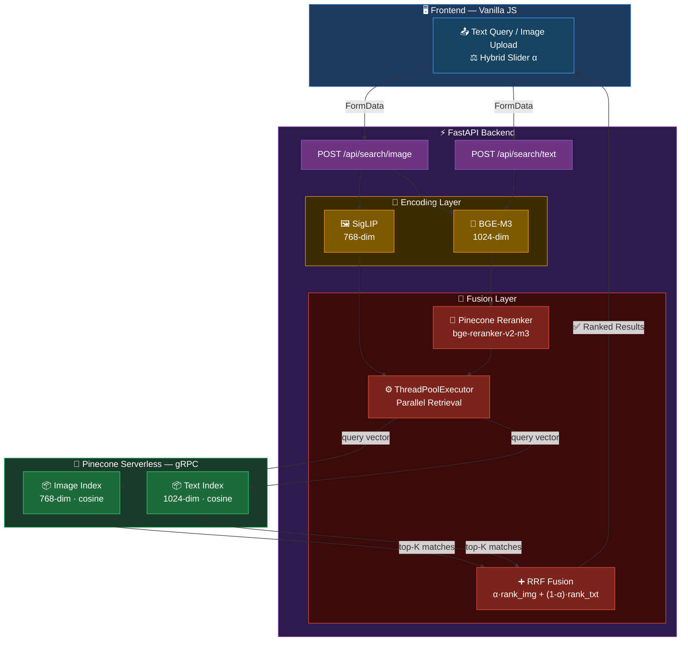

# 🔍 Semantic Fashion Search — Multimodal AI Retrieval System

> Two-stage hybrid search engine that finds fashion products using **image**, **text**, or **both simultaneously** — powered by SigLIP, BGE-M3, and Pinecone vector database.


---

## What This Project Does

A production-grade **multimodal search API** that allows users to search a fashion catalogue by:

- 📷 **Image** — upload a product photo, find visually similar items
- 📝 **Text** — describe what you're looking for in natural language
- 🔀 **Hybrid** — combine both with adjustable weight via a slider (RRF fusion)

Results are reranked using Pinecone's inference reranker for higher relevance quality.

---

## System Architecture




---

## Key Technical Highlights

| Component | Detail |
|---|---|
| **Image Encoder** | SigLIP (`google/siglip-so400m-patch14-384`), 768-dim |
| **Text Encoder** | BGE-M3 (`BAAI/bge-m3`), 1024-dim, mean pooling + L2 norm |
| **Vector DB** | Pinecone Serverless (AWS `us-east-1`), gRPC client |
| **Reranker** | Pinecone Inference API (`bge-reranker-v2-m3`) |
| **Fusion** | Reciprocal Rank Fusion (RRF, k=60) with tunable α |
| **Parallelism** | Image + text retrieval run concurrently via `ThreadPoolExecutor` |
| **API** | FastAPI with async lifespan, dependency injection, CORS |
| **Serving** | Uvicorn + Docker Compose |

---

## Search Modes

### Image-only
Encodes uploaded image with SigLIP → queries image index → returns top-K matches.

### Text-only
Encodes query with BGE-M3 → queries text index → reranks with Pinecone Inference → returns top-K.

### Hybrid (Image + Text)
Both retrievals run **in parallel** (ThreadPoolExecutor), then fused:

```
final_score(d) = α / (k + rank_image(d))  +  (1-α) / (k + rank_text(d))
```

`α = 1.0` → pure image · `α = 0.5` → balanced · `α = 0.0` → pure text

---

## Project Structure

```
├── app/
│   ├── api/routes.py           # FastAPI endpoints
│   ├── core/search_engine.py   # Two-stage retrieval + RRF fusion
│   ├── dependencies.py         # Service registry (DI container)
│   └── main.py                 # App lifespan, CORS, static files
│
├── embedding/
│   ├── base_model.py           # Abstract base class
│   ├── siglip2_pytorch.py      # SigLIP image encoder (768-dim)
│   └── bge_m3_pytorch.py       # BGE-M3 text encoder (1024-dim)
│
├── services/
│   ├── embedding_service.py    # Singleton embedding facade
│   └── pinecone_service.py     # Sync (gRPC) + Async Pinecone clients
│
├── scripts/
│   ├── build_index.py          # Batch encode & upsert to Pinecone
│   └── create_indexes.py       # One-time Pinecone index provisioning
│
├── fashion-finder-web-app/     # Vanilla JS frontend
│   ├── index.html
│   ├── css/
│   └── js/                     # api.js, filters.js, shop.js
│
├── config.py                   # Centralised configuration (env-based)
├── docker-compose.yml
└── Dockerfile
```

---

## API Endpoints

| Method | Endpoint | Description |
|---|---|---|
| `GET` | `/api/health` | Model + index liveness info |
| `POST` | `/api/search/image` | Image or hybrid search |
| `POST` | `/api/search/text` | Text-only search |
| `GET` | `/api/categories` | List of supported categories |
| `GET` | `/api/stats` | Pinecone index vector counts |
| `GET` | `/api/readiness` | Kubernetes-style readiness probe |
| `GET` | `/ping` | Minimal liveness ping |

---

## Getting Started

### Prerequisites

- Python 3.10+
- Docker & Docker Compose
- Pinecone account (Serverless, free tier works)
- GPU recommended (CPU inference supported)

### 1. Clone & Configure

```bash
git clone https://github.com/your-username/semantic-fashion-search.git
cd semantic-fashion-search
```

Create a `.env` file:

```env
PINECONE_API_KEY=your_pinecone_api_key
PINECONE_IMAGE_INDEX_NAME=fashion-image-index
PINECONE_TEXT_INDEX_NAME=fashion-text-index
PINECONE_NAMESPACE=fashion
PINECONE_RERANK_MODEL=bge-reranker-v2-m3
SIGLIP_MODEL_NAME=google/siglip-so400m-patch14-384
TEXT_MODEL_NAME=BAAI/bge-m3
DEVICE=cuda   # or cpu
```

### 2. Run with Docker

```bash
docker-compose up --build
```

### 3. Run Locally

```bash
pip install -r requirements.txt

# Step 1 — Create Pinecone indexes (run once)
python scripts/create_indexes.py

# Step 2 — Build the vector index from your dataset
python scripts/build_index.py

# Step 3 — Start the API
uvicorn app.main:app --host 0.0.0.0 --port 8000 --reload
```

### 4. Open the Frontend

Open `fashion-finder-web-app/index.html` in your browser.
Ensure the API is running at `http://127.0.0.1:8000`.

---

## Dataset

Uses the [Fashion Product Images (Small)](https://www.kaggle.com/datasets/paramaggarwal/fashion-product-images-small) dataset from Kaggle.

```
data/fashion-mini/
├── data.csv        # Product metadata (id, display name, category, description)
└── data/           # Product images (.jpg)
```

---

## Tech Stack

**Backend**
- [FastAPI](https://fastapi.tiangolo.com/) — async REST API
- [PyTorch](https://pytorch.org/) — model inference
- [Transformers](https://huggingface.co/docs/transformers) — SigLIP + BGE-M3
- [Pinecone](https://www.pinecone.io/) — vector storage + reranking

**Frontend**
- Vanilla HTML/CSS/JavaScript (no framework dependency)
- Responsive sidebar layout with hybrid search controls

**Infrastructure**
- Docker + Docker Compose
- Uvicorn ASGI server

---

## Engineering Decisions

**Why two separate indexes?**
SigLIP produces 768-dim image embeddings; BGE-M3 produces 1024-dim text embeddings. Pinecone indexes are dimension-specific, so separate indexes are required — this also allows independent scaling.

**Why ThreadPoolExecutor for hybrid search?**
Pinecone gRPC calls are I/O-bound. Running image and text queries in parallel threads cuts hybrid search wall-clock latency to `max(t_image, t_text)` instead of `t_image + t_text`.

**Why RRF over weighted score fusion?**
RRF is score-agnostic — it only uses rank position, making it robust to scale differences between cosine similarity (image) and reranker scores (text) without requiring calibration.

**Why singleton EmbeddingService?**
Loading SigLIP and BGE-M3 into GPU memory is expensive (~2–4s). The singleton pattern ensures models are loaded once at startup and reused across all requests.

---

## Author

**Mario Valerian Rante Ta'dung**
- GitHub: [@riooorante](https://github.com/riooorante)
- LinkedIn: [linkedin.com/in/mario-tadung](https://linkedin.com/in/mario-tadung)
- Email: rantetadungrio@gmail.com
```


